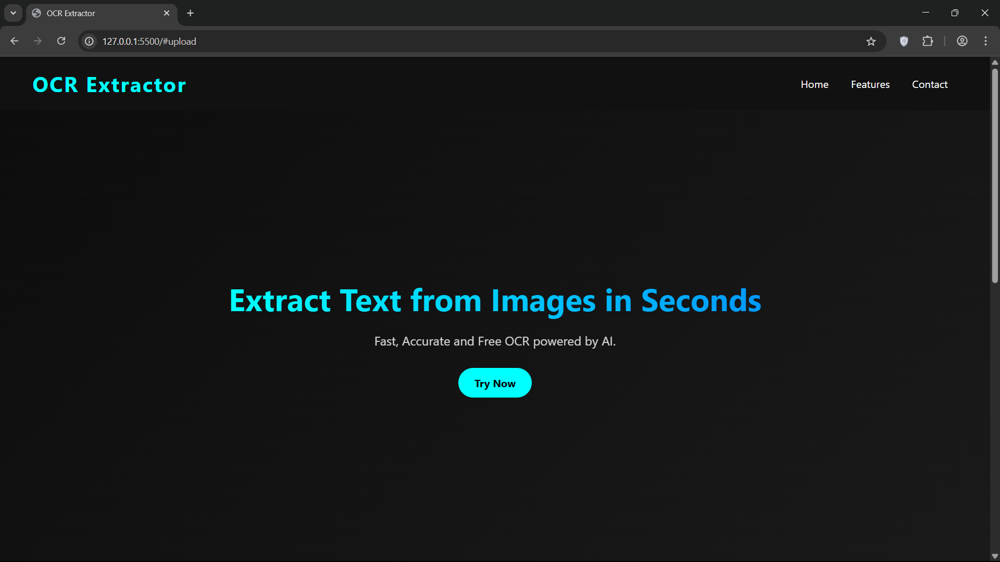
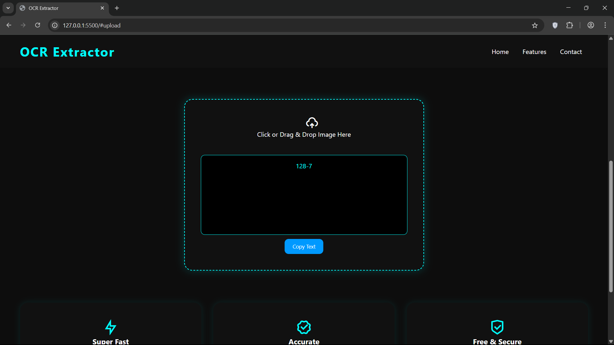
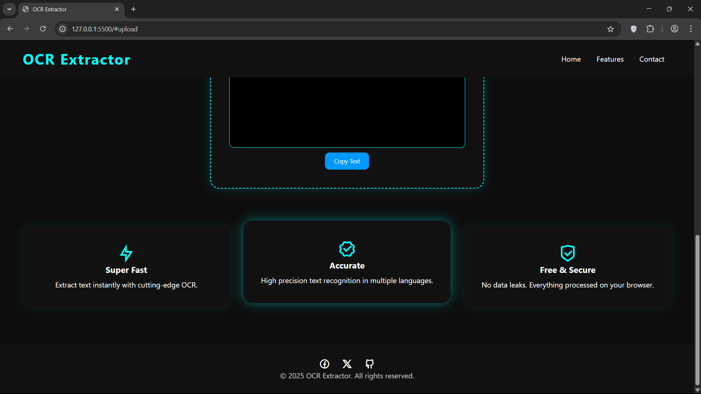

### 🖼️ OCR-Extractor

An intuitive and efficient tool to **extract text from images and scanned documents** using optical character recognition (OCR).  
Ideal for developers, researchers, or anyone needing to digitize text from visual sources.

---

### 🚀 Features
- 🔍 Supports uploading images (PNG, JPEG, BMP) and extracting text content.  
- ⚙️ Real-time processing with instant results.  
- 📁 Works for scanned documents, screenshots, and photos.  
- 🧩 Minimal and clean UI for quick usage.  
- 📱 Responsive design — usable on desktop and mobile.

---

### 🖼️ Screenshots
<p align="center">
  
  
  
</p>

---

### ⚙️ Installation & Run

```bash
git clone https://github.com/VibelessYoung/OCR-Extractor.git
cd OCR-Extractor
